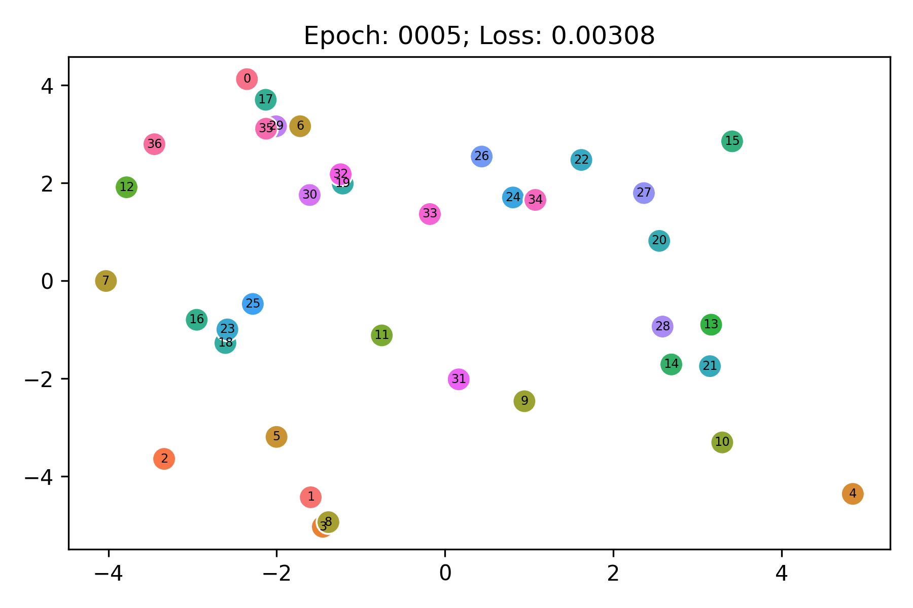

# translational-toys

This repository contains tools for generating toy knowledge graphs representing interesting geometry that correspond to
the philosophies behind knowledge graph embedding models like TransE.
It uses [PyKEEN](https://github.com/pykeen/pykeen) to train the models and animate the evolution of the entity
embeddings.

## Line

A linear dataset embedded with TransE/SoftPlus Loss by running `python cli.py line`:

<picture>
  <source srcset="results/line/embedding.webp" type="image/webp">
  <source srcset="results/line/embedding.gif" type="image/png"> 
  
</picture>

## Square Grid in 2D

A square grid dataset embedded with TransE/NSSA Loss by running `python cli.py squares`:

<picture>
  <source srcset="results/square_grid/embedding.webp" type="image/webp">
  <source srcset="results/square_grid/embedding.gif" type="image/png"> 
  
</picture>

Additional idea: try training in much higher dimensions, then use ISOMAP to reduce
back down to 2D and see how true it is.

## Hexagonal Grid in 2D

A hexagonal grid dataset embedded with TransE/SoftPlus Loss by running `python cli.py hexagons`:

<picture>
  <source srcset="results/hexagon_grid/embedding.webp" type="image/webp">
  <source srcset="results/hexagon_grid/embedding.gif" type="image/png"> 
  
</picture>

**Note** the hexagonal grid shape is not learned if there are no constraints on the relations because
it's easier to learn different sizes, and just create a square grid. To get this behavior, I ran a modified
TransE in which I set the relation constrainer to `normalize`.

## Circle in 2D

TODO
