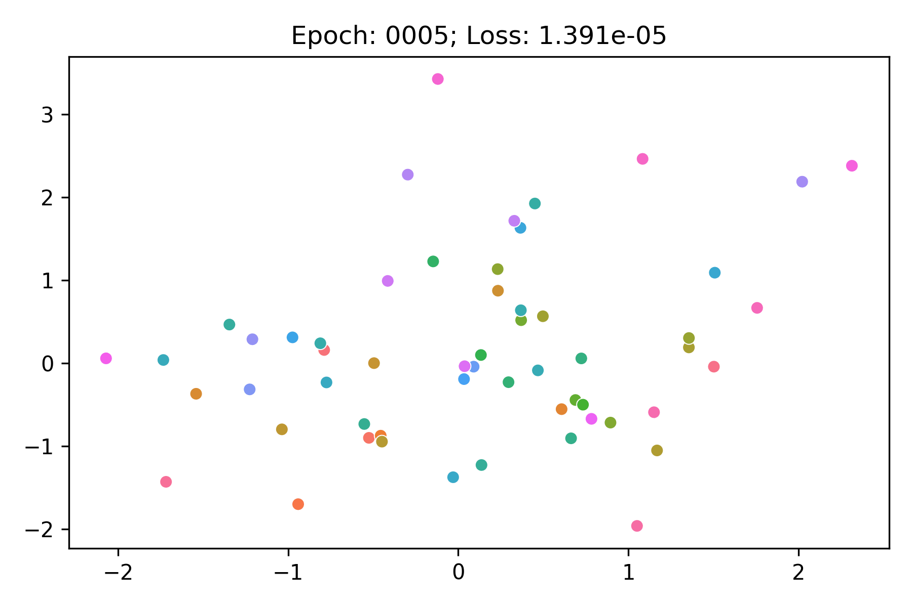

# translational-toys

This repository contains tools for generating toy knowledge graphs representing interesting geometry that correspond to
the philosophies behind knowledge graph embedding models like TransE.

It uses [PyKEEN](https://github.com/pykeen/pykeen) to train the models and animate the evolution of the entity
embeddings.

A linear dataset embedded with TransE/SoftPlus Loss:

A square grid dataset embedded with TransE/NSSA Loss:

A hexagonal grid dataset with TransE:

TODO

A circular dataset embedded with RotatE:
