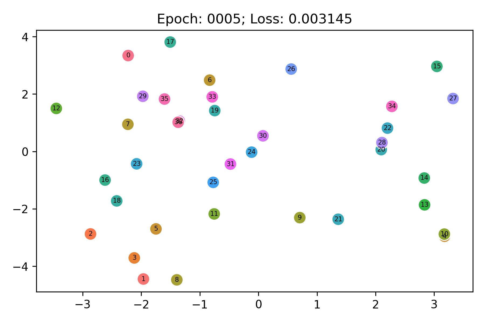

# translational-toys

This repository contains workflows for training knowledge graph embedding models
on knowledge graphs representing interesting geometries (generated
by [`geometric_graphs`](https://github.com/cthoyt/geometric-graphs/))
using [PyKEEN](https://github.com/pykeen/pykeen) and animate the evolution of
their entity embeddings.

## Line

A linear dataset embedded with TransE/SoftPlus Loss by
running `python cli.py line`:

<picture>
  <source srcset="results/line/embedding.webp" type="image/webp">
  <source srcset="results/line/embedding.gif" type="image/gif"> 
  
</picture>

## Square Grid in 2D

A square grid dataset embedded with TransE/NSSA Loss by
running `python cli.py squares`:

<picture>
  <source srcset="results/square_grid/embedding.webp" type="image/webp">
  <source srcset="results/square_grid/embedding.gif" type="image/gif"> 
  
</picture>

Additional idea: try training in much higher dimensions, then use ISOMAP to
reduce back down to 2D and see how true it is.

## Hexagonal Grid in 2D

A hexagonal grid dataset embedded with TransE/SoftPlus Loss by
running `python cli.py hexagons`:

<picture>
  <source srcset="results/hexagon_grid/embedding.webp" type="image/webp">
  <source srcset="results/hexagon_grid/embedding.gif" type="image/gif"> 
  
</picture>

**Note** the hexagonal grid shape is not learned if there are no constraints on
the relations because it's easier to learn different sizes, and just create a
square grid. To get this behavior, I ran a modified TransE in which I set the
relation constrainer to `normalize`.

## Circle in 2D

TODO
